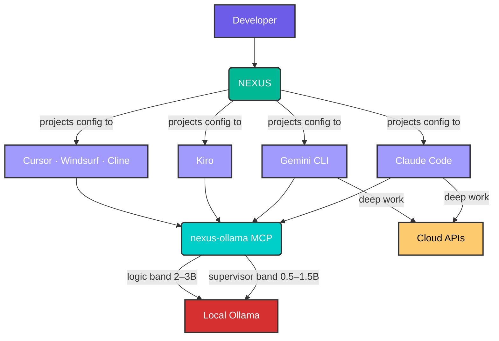

# NEXUS

[](https://github.com/canoo/agent-nexus/releases)
[](https://github.com/canoo/agent-nexus/actions/workflows/ci.yml)
[](LICENSE)
[](https://go.dev)
[](https://github.com/canoo/agent-nexus)
[](https://github.com/canoo/agent-nexus)
[](https://coderabbit.ai)

**Network of EXperts, Unified in Strategy**

Route boilerplate to local models. Save cloud credits for what matters. One config, every AI tool.

<p align="center">
  
</p>

## Quick Start

```bash
curl -sSL https://raw.githubusercontent.com/canoo/agent-nexus/main/install.sh | bash
nexus
```

> Make sure `~/.local/bin` is in your `PATH`: `export PATH="$HOME/.local/bin:$PATH"`

---

## The Problem

Every AI coding tool speaks its own configuration dialect. Switching tools — or using more than one — means manually maintaining separate instruction files for each:

| Tool | Config file |
|---|---|
| Claude Code | `CLAUDE.md`, `AGENTS.md` |
| Cursor | `.cursor/rules/*.mdc` |
| Windsurf | `.windsurfrules` |
| Copilot | `.github/copilot-instructions.md` |
| Kiro | `.kiro/steering/*.md` |
| Cline | `.clinerules` |
| Continue.dev | `.continuerc.json` / `config.yaml` |
| Amazon Q | `.qrules` |

Developers describe this as "copy-pasting their soul from one tool's rule file to another." When a team member switches tools or a new one launches, all of that context has to be manually migrated — and the project memory trapped in one tool's scratchpad is lost entirely.<sup>[1]</sup>

On top of that, every tool has its own MCP server config location. Adding a single MCP server means editing JSON in three or four different places.

**NEXUS is the layer underneath all of them.** Define your project instructions, personas, and routing rules once. NEXUS projects them into each tool's native format, routes appropriate tasks to local models to reduce cloud spend, and preserves context across sessions and tool switches.

---

## What NEXUS Does Today

### 1. Complexity-based local routing (zero-token git)

NEXUS routes micro-tasks to local Ollama models based on complexity, reserving cloud API tokens for work that actually needs them. The most concrete example: commit messages, lint fixes, and boilerplate generation routed to a local 1.5B model instead of Sonnet.

Developers routing these tasks locally report saving thousands of cloud tokens per day.<sup>[2]</sup>

```
Task: generate commit message from diff
→ Local:  qwen2.5-coder:1.5b  (~143 t/s, $0.00)
→ Cloud:  claude-sonnet        (~70 t/s, $0.003/req)
```

This matters more as AI Credits pricing shifts toward token-based billing across major providers.

### 2. Specialist persona system

NEXUS ships a library of specialist agent personas — engineering roles with defined responsibilities, tooling knowledge, and escalation behaviour. The orchestrator delegates to the right specialist rather than doing everything in one context.

Personas live in `~/.config/nexus/personas/` as markdown files. The active persona set is projected into every configured tool automatically.

### 3. Unified config projection

Steering files, personas, and routing rules are maintained in one place and projected into each installed AI tool's native format via symlinks and generated files. When you update a persona or routing rule, `nexus sync` propagates it everywhere.

### 4. MCP server for local model delegation

The `nexus-ollama` MCP server exposes local Ollama delegation as standard MCP tools. Any MCP-capable tool (Claude Code, Cursor, Windsurf, Cline, Continue.dev, Kiro) can route tasks locally without custom integration.

```json
{
  "mcpServers": {
    "nexus-ollama": {
      "command": "node",
      "args": ["~/.config/nexus/tools/mcp/server.mjs"]
    }
  }
}
```

Available tools: `ollama_commit_msg`, `ollama_boilerplate`, `ollama_test_scaffold`, `ollama_lint_fix`, `ollama_logic_refactor`.

### 5. TUI for setup and health

An interactive terminal UI handles installation, configuration, health checks, and updates. No config file editing required to get started.

---

## Tool Compatibility

| Tool | Config format | MCP support | NEXUS status |
|---|---|---|---|
| Claude Code | `AGENTS.md`, `CLAUDE.md` | ✓ | ✅ Full |
| Gemini CLI | `AGENTS.md` | ✓ | ✅ Full |
| Kiro | `.kiro/steering/*.md` | ✓ | ✅ Full |
| Cursor | `.cursor/rules/*.mdc` | ✓ | 🔄 Planned — v0.2.5 |
| Copilot | `.github/copilot-instructions.md` | GitHub-managed | 🔄 Planned — v0.2.5 |
| Windsurf | `.windsurfrules` | ✓ | 🔄 Planned — v0.2.5 |
| Cline | `.clinerules` | VS Code shared | 🔄 Planned — v0.2.5 |
| Continue.dev | `.continuerc.json` | ✓ | 🔄 Planned — v0.2.5 |
| Amazon Q | `.qrules` | ✓ | 📋 Backlog |
| Crush | Agent Skills | ✓ | 📋 Backlog |
| Aider | `.aider.conf.yml` | — | 📋 Backlog |
| Zed | `.zed/settings.json` | ✓ | 📋 Backlog |

---

## Architecture



---

## Local Model Configuration

NEXUS defaults to `http://localhost:11434`. To use a dedicated GPU server, configure via the TUI or edit `.env` directly.

### Routing bands

| Band | Models | Tasks | Hardware |
|---|---|---|---|
| Supervisor | `qwen2.5-coder:1.5b` | Commit messages, JSON gen, boilerplate | 4 GB VRAM — >120 t/s |
| Logic | `llama3.2:3b` | Code generation, refactoring, lint fixes | 4 GB VRAM — ~75 t/s |
| Logic+ | `qwen2.5-coder:7b` | Complex refactors, multi-file edits | 8 GB VRAM |
| Heavy | `qwen2.5-coder:32b` | Architecture-level generation | 16 GB+ VRAM |

The supervisor and logic bands are the defaults. Override any route via environment variable:

```bash
NEXUS_SUPERVISOR_MODEL=qwen2.5-coder:1.5b
NEXUS_LOGIC_MODEL=llama3.2:3b
NEXUS_MODEL_COMMIT_MSG=qwen2.5-coder:1.5b   # per-task override
```

See [docs/model-configuration.md](docs/model-configuration.md) for hardware-specific presets (RTX 3060–5090, MacBook M3/M3 Max, multi-GPU).

---

## TUI

```
⚡ NEXUS Framework Manager
   v0.1.5

▸ Install NEXUS
  Configure
  Health Check
  Update
  Uninstall NEXUS

j/k: navigate • enter: select • q: quit
```

| Screen | What it does |
|---|---|
| **Install** | Step-by-step wizard: validates repo, creates symlinks, configures MCP, checks deps, pulls Ollama models |
| **Configure** | Edit Ollama host URL and model overrides inline |
| **Health Check** | Verifies Ollama reachability, symlink integrity, MCP server status |
| **Update** | Checks latest release and self-updates with checksum verification |
| **Uninstall** | Removes all symlinks and binary with confirmation |

---

## Installation

### One-liner

```bash
curl -sSL https://raw.githubusercontent.com/canoo/agent-nexus/main/install.sh | bash
```

Downloads the pre-built `nexus` binary and clones the repo to `~/.config/nexus/repo`.

### From source

```bash
git clone https://github.com/canoo/agent-nexus.git
cd agent-nexus
bash setup-nexus.sh
```

Requires Go 1.25+ to build the TUI binary.

---

## Project Structure

```
core/           Orchestrator instructions (NEXUS.md, AGENTS.md, kiro steering)
personas/       Specialist agent definitions
tools/tui/      NEXUS TUI (Go / Bubbletea v2)
tools/mcp/      nexus-ollama MCP server (Node.js)
tools/compat/   Tool driver registry (tools.json) — planned v0.2.5
prompts/        Engineering rules and quality gates
mcp-configs/    MCP configuration templates
docs/           Documentation and hardware presets
tests/          Integration tests
```

---

## Roadmap

| Version | Theme | Key deliverables |
|---|---|---|
| **v0.1.6** | Security fixes | Checksum hardening, input validation, PAT removal — [in progress] |
| **v0.2.0** | Observability core | Session logging, cost tracker, live TUI dashboard |
| **v0.2.1** | CLI usage ingestion | Tokscale adapter, unified usage dashboard |
| **v0.2.5** | Universal sync layer | `nexus adopt`, `nexus sync`, AGENTS.md projection, tool driver system, nexus-context MCP, Smithery MCP registry, compatibility matrix |
| **v0.3.0** | Dynamic routing | Auto model selection by task complexity, latency fallback, chain-of-models |
| **v0.3.5** | Community benchmarks | Benchmark schema, hardware-tiered test runner, community submission pipeline, results showcase |
| **v0.4.0** | Persona marketplace | Community persona sharing, persona composition, auto-update |
| **v1.0.0** | Stable | Windows/Docker support, team features, stable public API |

---

## Prerequisites

**Required:** Bash, one or more supported AI tools (see [compatibility table](#tool-compatibility))

**Optional:** [Node.js](https://nodejs.org/) ≥18 (for MCP server), [Ollama](https://ollama.com/) (for local model delegation)

> **Platform support:** Linux and macOS. Windows support is tracked in [#18](https://github.com/canoo/agent-nexus/issues/18).

> No Go toolchain needed — the `nexus` binary is a pre-built download.

---

## Testing

```bash
# Go unit tests
cd tools/tui && go test ./...

# Full install/uninstall cycle (isolated temp $HOME)
bash tests/test-install-cycle.sh
```

---

## Contributing

See [CONTRIBUTING.md](CONTRIBUTING.md) for development setup, PR guidelines, and commit conventions.

## Security

See [SECURITY.md](SECURITY.md) for vulnerability reporting.

---

## Research and Sources

NEXUS's design is informed by documented developer pain points in the AI coding tool ecosystem:

<sup>[1]</sup> Configuration wall and context leakage: r/ChatGPTCoding, r/LocalLLaMA, r/ClaudeCode — April 2026. Developers describe manually syncing `.cursor/rules/*.mdc`, `CLAUDE.md`, and `.github/copilot-instructions.md` as "copy-pasting their soul" between tools.

<sup>[2]</sup> Zero-token git workflow: r/ClaudeCode — April 2026. Teams routing commit messages and boilerplate generation to local Ollama (`qwen2.5-coder:1.5b`) report saving thousands of cloud tokens per day.

Additional references: [Smithery MCP registry](https://smithery.ai) · [Official MCP registry](https://registry.modelcontextprotocol.io) · [Model Context Protocol](https://modelcontextprotocol.io)

---

## License

[MIT](LICENSE) © 2026 [Codelogiic](https://www.codelogiic.com)
