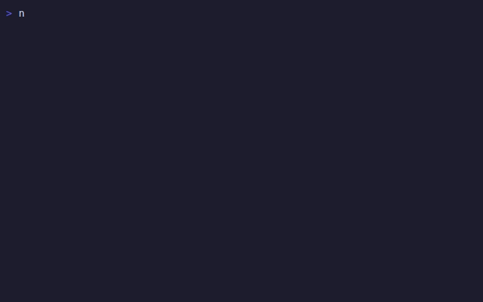
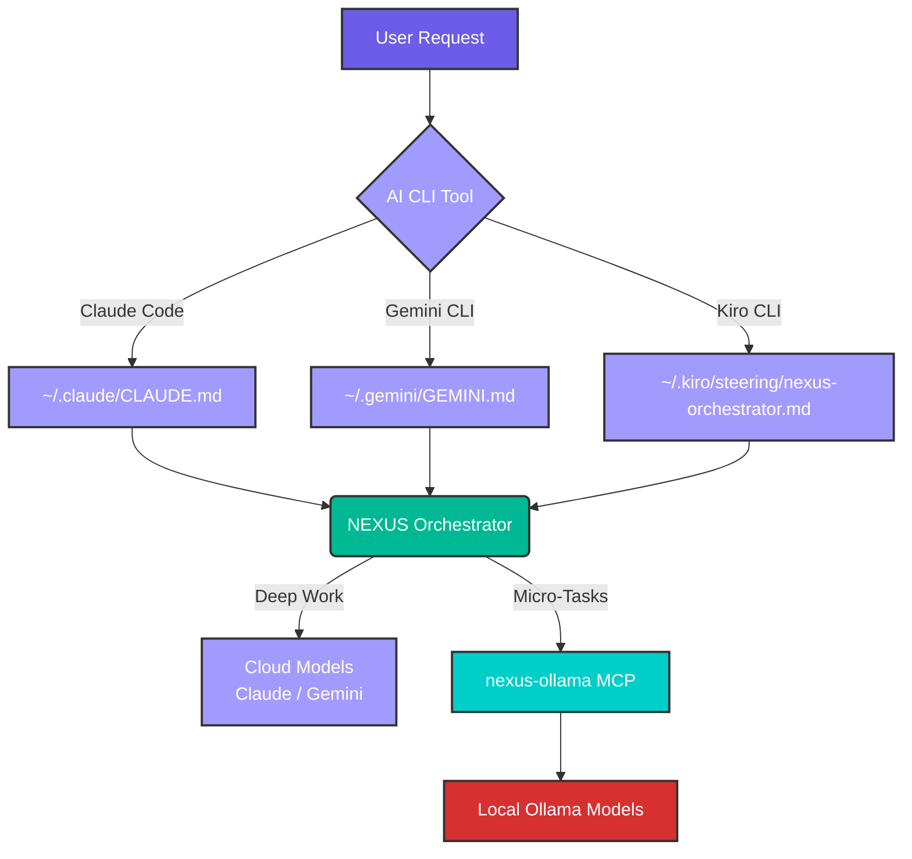

# NEXUS

[](https://github.com/canoo/agent-nexus/releases)
[](https://github.com/canoo/agent-nexus/actions/workflows/ci.yml)
[](LICENSE)
[](https://go.dev)
[](https://github.com/canoo/agent-nexus)
[](https://github.com/canoo/agent-nexus)
[](https://coderabbit.ai)

**Network of EXperts, Unified in Strategy** — a tool-agnostic framework for multi-model agentic orchestration. Whatever AI tools you use today, NEXUS makes them better. Define personas, route tasks to cloud or local LLMs, track usage across every tool, and manage everything through an interactive TUI.

<p align="center">
  
</p>

## Quick Start

```bash
curl -sSL https://raw.githubusercontent.com/canoo/agent-nexus/main/install.sh | bash
nexus
```

The first command downloads the `nexus` binary and clones the repo. The second launches the TUI to walk you through setup.

> Make sure `~/.local/bin` is in your `PATH`: `export PATH="$HOME/.local/bin:$PATH"`

## Philosophy

The AI tooling landscape changes every week. New CLIs, new models, new frameworks. NEXUS doesn't bet on any single tool — it's the layer underneath all of them.

- **Bring your own tools.** Claude Code, Gemini CLI, Kiro CLI, Cursor, Codex, OpenClaw, or whatever ships next month. NEXUS works with what you already use.
- **Bring your own models.** Cloud APIs, local Ollama, or both. NEXUS routes tasks to the right tier based on complexity, not vendor lock-in.
- **One config, every tool.** Personas, routing rules, and orchestration logic are defined once and shared across all your AI tools via symlinks.
- **Observe everything.** Track usage, costs, and routing decisions across your entire AI toolkit — not just one tool's silo.

NEXUS doesn't replace your tools. It amplifies them.

## What NEXUS Does

NEXUS sits between your AI CLI tools and your local/cloud models. It:

1. **Routes tasks** to the right model tier — cloud for deep work, local for micro-tasks
2. **Manages personas** — specialized agent definitions for different engineering roles
3. **Delegates locally** via an MCP server that routes to Ollama models on your machine or network
4. **Configures everything** through symlinks — your AI tools read from NEXUS without knowing it

## Architecture



## Installation

### One-liner (recommended)

```bash
curl -sSL https://raw.githubusercontent.com/canoo/agent-nexus/main/install.sh | bash
```

Downloads the pre-built `nexus` binary for your platform and clones the repo to `~/.config/nexus/repo`.

### From source

```bash
git clone https://github.com/canoo/agent-nexus.git
cd agent-nexus
bash setup-nexus.sh
```

Requires Go 1.25+ to build the TUI binary.

## NEXUS TUI

```
⚡ NEXUS Framework Manager
   v0.1.1

▸ Install NEXUS
  Configure
  Health Check
  Uninstall NEXUS

j/k: navigate • enter: select • q: quit
```

| Screen | What it does |
|--------|-------------|
| **Install** | Step-by-step wizard: validates repo, creates symlinks, configures MCP, checks deps, pulls Ollama models |
| **Configure** | Edit Ollama host URL and model overrides inline, saves to `.env` |
| **Health Check** | Verifies Ollama reachability and symlink status |
| **Uninstall** | Removes all symlinks and the binary (with confirmation) |

## Local LLM Configuration

NEXUS defaults to `http://localhost:11434` for Ollama. To use a dedicated GPU server:

```bash
cp .env.example .env
# Edit OLLAMA_HOST_URL to your server's address
```

Or configure interactively via the TUI's **Configure** screen.

### Default Models (4GB VRAM)

| Band | Model | Use Case | Speed |
|------|-------|----------|-------|
| Supervisor | `qwen2.5-coder:1.5b` | Formatting, JSON, boilerplate | >120 t/s |
| Logic | `llama3.2:3b` | Code generation, refactoring | ~75 t/s |

See [docs/model-configuration.md](docs/model-configuration.md) for hardware-specific presets (RTX 3060–5090, MacBook M3/M3 Max, multi-GPU).

### MCP Server

The MCP server lets AI CLI tools route micro-tasks to local Ollama automatically:

```json
{
  "mcpServers": {
    "nexus-ollama": {
      "command": "node",
      "args": ["~/.config/nexus/tools/mcp/server.mjs"]
    }
  }
}
```

Tools available: `ollama_commit_msg`, `ollama_lint_fix`, `ollama_logic_refactor`.

## Project Structure

```
core/           Core orchestrator instructions (NEXUS.md, CLAUDE.md)
personas/       Agent persona definitions
tools/tui/      NEXUS TUI (Go / Bubbletea v2)
tools/mcp/      Ollama MCP server (Node.js)
prompts/        Engineering rules and quality gates
mcp-configs/    MCP configuration templates
docs/           Documentation and hardware presets
tests/          Integration tests
```

## Prerequisites

**Required:** Bash, one or more AI CLI tools ([Claude Code](https://docs.anthropic.com/en/docs/claude-code), [Gemini CLI](https://github.com/google-gemini/gemini-cli), or [Kiro CLI](https://kiro.dev))

**Optional:** [Node.js](https://nodejs.org/) (for MCP server), [Ollama](https://ollama.com/) (for local LLM delegation)

> **Platform support:** Linux and macOS. Windows is not yet supported — see [#18](https://github.com/canoo/agent-nexus/issues/18) for tracking.

> No Go toolchain needed — the `nexus` binary is distributed as a pre-built download.

## Testing

```bash
# Go unit tests
cd tools/tui && go test ./...

# Full install/uninstall cycle (isolated temp $HOME)
bash tests/test-install-cycle.sh
```

## Uninstallation

From the TUI: select **Uninstall NEXUS**.

Or: `bash teardown-nexus.sh`

Teardown removes only what setup created — your files are never touched.

## Contributing

See [CONTRIBUTING.md](CONTRIBUTING.md) for development setup, PR guidelines, and commit conventions.

## Security

See [SECURITY.md](SECURITY.md) for vulnerability reporting.

## License

[MIT](LICENSE) © 2026 [Codelogiic](https://www.codelogiic.com)
