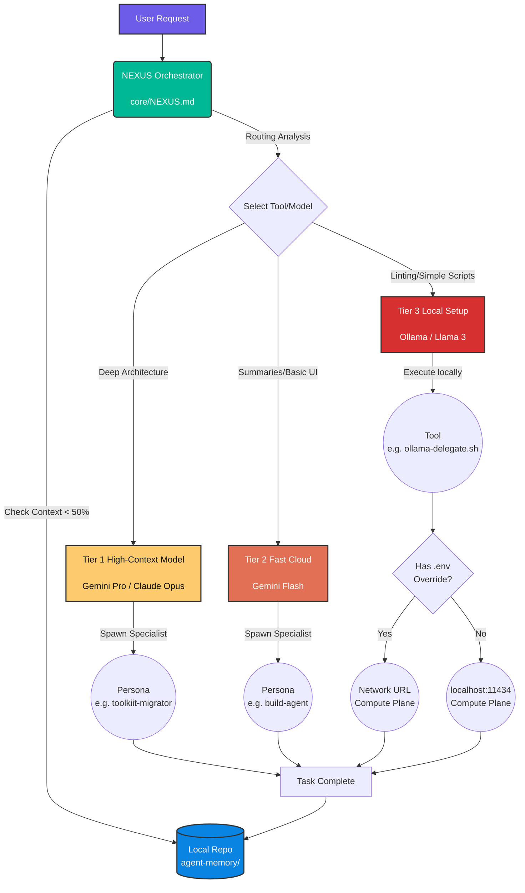

# NEXUS Environment (Agentic Framework)

NEXUS (Network of EXperts, Unified in Strategy) is a central repository for defining multi-model agentic behaviors, personas, prompts, and orchestration tools.

## Architecture

This repository operates by decoupling monolithic agent `.md` files into a lightweight, structural format. Once instantiated out to your local environment (via `setup-nexus.sh`), the OS hot-swaps dotfiles to point straight into this centralized workflow.

## Developer Workflow

Here is how the NEXUS Orchestrator routes interactions:

## 🔌 Local LLM Configuration (Compute Plane)

NEXUS decouples your orchestration logic (Control Plane) from your local inference execution (Compute Plane). This allows you to run orchestrators lightly on a laptop while routing raw compute tasks to a dedicated GPU machine.

1. **Zero-Config Default**: By default, the toolkit routes all local micro-tasks directly to `http://localhost:11434`.
2. **Dedicated LLM Setup**: If you want to use a dedicated LLM server on your network:
   - Copy `.env.example` to `.env` in the root directory.
   - Update `OLLAMA_HOST_URL` inside `.env` to match your network machine's IP (e.g. `http://192.168.1.100:11434`).

## Structure
- `core/`: Core instructions (`NEXUS.md` replacing `GEMINI.md`).
- `personas/`: Granular agent personas.
- `tools/`: Utility Python and Bash scripts.
- `prompts/`: Standard engineering rules and quality gates.
- `mcp-configs/`: Server configuration standards.
- `agent-memory/`: Locally tracked storage structure (not synced to source control).

## Installation
Run `./setup-nexus.sh` to initialize symlinking to `~/.gemini/` and `~/.config/nexus/`.
Run `./teardown-nexus.sh` to revert to baseline static files.
