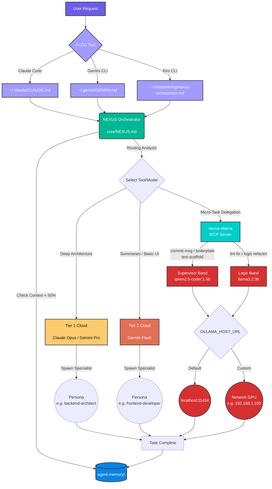

# NEXUS Environment (Agentic Framework)

NEXUS (Network of EXperts, Unified in Strategy) is a central repository for defining multi-model agentic behaviors, personas, prompts, and orchestration tools.

## Architecture

This repository operates by decoupling monolithic agent `.md` files into a lightweight, structural format. Once instantiated out to your local environment (via `setup-nexus.sh`), the OS hot-swaps dotfiles to point straight into this centralized workflow.

## Developer Workflow

Here is how the NEXUS Orchestrator routes interactions:



## 🔌 Local LLM Configuration (Compute Plane)

NEXUS decouples your orchestration logic (Control Plane) from your local inference execution (Compute Plane). This allows you to run orchestrators lightly on a laptop while routing raw compute tasks to a dedicated GPU machine.

1. **Zero-Config Default**: By default, the toolkit routes all local micro-tasks directly to `http://localhost:11434`.
2. **Dedicated LLM Setup**: If you want to use a dedicated LLM server on your network:
   - Copy `.env.example` to `.env` in the root directory.
   - Update `OLLAMA_HOST_URL` inside `.env` to match your network machine's IP (e.g. `http://192.168.1.100:11434`).

### Hardware Benchmarks & Model Delegation
Current internal tracking evaluates local constraints against a **4GB VRAM limit (RTX 3050 Mobile)**. Based on strict hardware caps:
- **0.5B - 1.5B (`qwen2.5-coder`)**: Runs blazing fast (>120 t/s). Route generic formatting and JSON abstractions here.
- **2B - 3B (`llama3.2:3b`)**: The optimal laptop threshold (~75 t/s). Route complex code generation here. No memory spillover.
- **4B - 7B+ (`qwen2.5:7b`)**: Drops rapidly (<15 t/s). VRAM spills into shared RAM. Avoid dynamic laptop execution.

**Future Hardware Hypothesis**: When moving to systems with **12GB-16GB VRAM** (e.g., RTX 4070/4080 desktop variants), the 7B–9B logic band acts natively natively inside memory without latency tax. At that hardware cap, the toolkit can be completely detached from Cloud dependence (Gemini/Claude) up through **Advanced Architect** tasks via specific Unsloth finetunes. 

### MCP Server (Automatic Local Delegation)

The MCP server lets Claude Code, Gemini CLI, and Kiro CLI route micro-tasks to your local Ollama instance automatically — no manual script calls needed.

**Prerequisites:**
```bash
ollama pull qwen2.5-coder:1.5b
ollama pull llama3.2:3b
cd tools/mcp && npm install
```

**Claude Code setup** — add to your project or global `.claude/settings.json`:
```json
{
  "mcpServers": {
    "nexus-ollama": {
      "command": "node",
      "args": ["~/.config/nexus/tools/mcp/server.mjs"]
    }
  }
}
```

**Custom Ollama host** (e.g. a GPU server on your network):
```json
{
  "mcpServers": {
    "nexus-ollama": {
      "command": "node",
      "args": ["~/.config/nexus/tools/mcp/server.mjs"],
      "env": {
        "OLLAMA_HOST_URL": "http://192.168.1.100:11434"
      }
    }
  }
}
```

Once configured, the AI will have access to tools like `ollama_commit_msg`, `ollama_lint_fix`, and `ollama_logic_refactor` that route work to your local models instead of using cloud compute.

## Structure
- `core/`: Core instructions (`NEXUS.md` replacing `GEMINI.md`).
- `personas/`: Granular agent personas.
- `tools/`: Utility scripts and MCP servers.
- `tools/mcp/`: Ollama MCP server for local model delegation.
- `prompts/`: Standard engineering rules and quality gates.
- `mcp-configs/`: MCP configuration templates.
- `agent-memory/`: Locally tracked storage structure (not synced to source control).

## Installation

Clone the repo anywhere on your machine:

```bash
git clone https://github.com/your-org/agent-nexus.git
cd agent-nexus
```

Run the setup script:

```bash
bash setup-nexus.sh
```

This will:
1. Symlink `core/NEXUS.md` to `~/.gemini/GEMINI.md` (Gemini CLI)
2. Symlink `core/CLAUDE.md` to `~/.claude/CLAUDE.md` (Claude Code)
3. Symlink `core/kiro-nexus-steering.md` to `~/.kiro/steering/nexus-orchestrator.md` (Kiro CLI)
4. Symlink `personas/`, `tools/`, `prompts/`, `mcp-configs/`, and `agent-memory/` into `~/.config/nexus/`

If any of these files already exist, the originals are backed up with a `.bak` extension before linking. The script auto-detects its own location, so it works from any clone path. Running it again is safe — it skips symlinks that are already correct.

After setup, all symlinks are verified. If anything is broken, the script exits with a non-zero code and tells you which link failed.

## Uninstallation

```bash
bash teardown-nexus.sh
```

This will:
1. Remove all symlinks created by setup
2. Restore any `.bak` backups to their original paths
3. Clean up empty directories (`~/.config/nexus/`, `~/.kiro/`) so nothing is left behind

Files that aren't NEXUS symlinks are never touched — teardown only removes what setup created.

## Testing

To verify the full install/uninstall cycle without touching your real config:

```bash
bash tests/test-install-cycle.sh
```

This runs setup and teardown inside an isolated temporary `$HOME` and validates:
- Fresh install creates and resolves all symlinks
- Re-running setup is idempotent (no errors, no broken state)
- Pre-existing user configs are backed up and restored correctly
- Teardown leaves no orphaned files or directories
- Setup fails early on an incomplete clone
