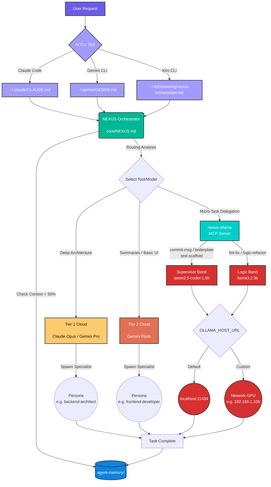

# NEXUS Environment (Agentic Framework)


NEXUS (Network of EXperts, Unified in Strategy) is a central repository for defining multi-model agentic behaviors, personas, prompts, and orchestration tools.

## Quick Start

```bash
curl -sSL https://raw.githubusercontent.com/canoo/agent-nexus/main/install.sh | bash
nexus
```

That's it. The first command downloads the `nexus` binary and clones the repo. The second launches the TUI to walk you through setup interactively.

> Make sure `~/.local/bin` is in your `PATH`. If it isn't: `export PATH="$HOME/.local/bin:$PATH"`

## Architecture

This repository operates by decoupling monolithic agent `.md` files into a lightweight, structural format. Once instantiated out to your local environment (via `setup-nexus.sh` or the `nexus` TUI), the OS hot-swaps dotfiles to point straight into this centralized workflow.

## Developer Workflow

Here is how the NEXUS Orchestrator routes interactions:



## 🔌 Local LLM Configuration (Compute Plane)

NEXUS decouples your orchestration logic (Control Plane) from your local inference execution (Compute Plane). This allows you to run orchestrators lightly on a laptop while routing raw compute tasks to a dedicated GPU machine.

1. **Zero-Config Default**: By default, the toolkit routes all local micro-tasks directly to `http://localhost:11434`.
2. **Dedicated LLM Setup**: If you want to use a dedicated LLM server on your network:
   - Copy `.env.example` to `.env` in the root directory.
   - Update `OLLAMA_HOST_URL` inside `.env` to match your network machine's IP (e.g. `http://192.168.1.100:11434`).

### Hardware Benchmarks & Model Delegation
Current internal tracking evaluates local constraints against a **4GB VRAM limit (RTX 3050 Mobile)**. Based on strict hardware caps:
- **0.5B - 1.5B (`qwen2.5-coder`)**: Runs blazing fast (>120 t/s). Route generic formatting and JSON abstractions here.
- **2B - 3B (`llama3.2:3b`)**: The optimal laptop threshold (~75 t/s). Route complex code generation here. No memory spillover.
- **4B - 7B+ (`qwen2.5:7b`)**: Drops rapidly (<15 t/s). VRAM spills into shared RAM. Avoid dynamic laptop execution.

**Better hardware?** The default models target 4GB VRAM. If you have more VRAM, you should upgrade — see **[docs/model-configuration.md](docs/model-configuration.md)** for hardware-specific presets covering RTX 3060 through RTX 5090, MacBook M3/M3 Pro/M3 Max, and multi-GPU setups.

Quick override example (16GB+ VRAM):
```bash
# .env
NEXUS_SUPERVISOR_MODEL="qwen2.5-coder:7b"
NEXUS_LOGIC_MODEL="qwen2.5:14b"
```

**Future Hardware Hypothesis**: When moving to systems with **12GB-16GB VRAM** (e.g., RTX 4070/4080 desktop variants), the 7B–9B logic band acts natively inside memory without latency tax. At that hardware cap, the toolkit can be completely detached from Cloud dependence (Gemini/Claude) up through **Advanced Architect** tasks via specific Unsloth finetunes.

### MCP Server (Automatic Local Delegation)

The MCP server lets Claude Code, Gemini CLI, and Kiro CLI route micro-tasks to your local Ollama instance automatically — no manual script calls needed.

**Claude Code setup** — add to your project or global `.claude/settings.json`:
```json
{
  "mcpServers": {
    "nexus-ollama": {
      "command": "node",
      "args": ["~/.config/nexus/tools/mcp/server.mjs"]
    }
  }
}
```

**Custom Ollama host** (e.g. a GPU server on your network):
```json
{
  "mcpServers": {
    "nexus-ollama": {
      "command": "node",
      "args": ["~/.config/nexus/tools/mcp/server.mjs"],
      "env": {
        "OLLAMA_HOST_URL": "http://192.168.1.100:11434"
      }
    }
  }
}
```

Once configured, the AI will have access to tools like `ollama_commit_msg`, `ollama_lint_fix`, and `ollama_logic_refactor` that route work to your local models instead of using cloud compute.

## Structure
- `core/`: Core instructions (`NEXUS.md` replacing `GEMINI.md`).
- `personas/`: Granular agent personas.
- `tools/`: Utility scripts and MCP servers.
- `tools/tui/`: NEXUS TUI application (Go / Bubbletea v2).
- `tools/mcp/`: Ollama MCP server for local model delegation.
- `prompts/`: Standard engineering rules and quality gates.
- `mcp-configs/`: MCP configuration templates.
- `docs/`: Documentation and test results.
- `docs/model-configuration.md`: Hardware-specific model presets and override guide.
- `agent-memory/`: Locally tracked storage structure (not synced to source control).

## Prerequisites

**Required:**
- Bash
- One or more AI CLI tools: [Claude Code](https://docs.anthropic.com/en/docs/claude-code), [Gemini CLI](https://github.com/google-gemini/gemini-cli), or [Kiro CLI](https://kiro.dev)

**Optional (recommended):**
- [Node.js](https://nodejs.org/) — required for the Ollama MCP server
- [Ollama](https://ollama.com/) — enables local LLM delegation via MCP

> **No Go? No problem.** The `nexus` binary is distributed as a pre-built download — no Go toolchain needed. If you prefer to build from source, you'll need [Go 1.25+](https://go.dev/dl/).

## Installation

One command:

```bash
curl -sSL https://raw.githubusercontent.com/canoo/agent-nexus/main/install.sh | bash
```

This downloads the `nexus` binary for your platform and clones the repo to `~/.config/nexus/repo`. Then run:

```bash
nexus
```

The TUI walks you through setup interactively:

```
⚡ Install NEXUS

✓ Validate repo              ~/.config/nexus/repo
✓ Symlink core files          3 core files linked
✓ Symlink config directories  5 directories linked
✓ Configure MCP server        nexus-ollama configured
✓ Check dependencies          found: node, ollama, git
⠋ Pull Ollama models

esc: back
```

Each step runs with a live spinner and reports what it did. Steps 1–4 (symlinks, MCP) are critical — if one fails, it stops and tells you why. Steps 5–6 (dependency checks, model pulls) are informational — missing Node or Ollama won't block setup, you just won't have MCP/local models until you install them.

> Make sure `~/.local/bin` is in your `PATH`. If it isn't, add this to your shell profile:
> ```bash
> export PATH="$HOME/.local/bin:$PATH"
> ```

### Alternative: Clone and Setup

If you prefer to clone manually or want to develop on the repo:

```bash
git clone https://github.com/canoo/agent-nexus.git
cd agent-nexus
bash setup-nexus.sh
```

The setup script does the same symlinks and MCP configuration. If Go 1.25+ is installed, it also builds the `nexus` binary to `~/.local/bin/nexus`.

## NEXUS TUI

The `nexus` command launches an interactive terminal UI for managing your NEXUS installation.

```
⚡ NEXUS Framework Manager
   v0.1.0

▸ Install NEXUS
  Configure
  Health Check
  Uninstall NEXUS

j/k: navigate • enter: select • q: quit
```

**Screens:**
- **Install** — step-by-step wizard: validates repo, creates symlinks, configures MCP, checks dependencies, pulls Ollama models
- **Configure** — edit Ollama host URL and model overrides inline, saves to `.env`
- **Health Check** — verifies Ollama reachability and all symlink status
- **Uninstall** — runs teardown with progress feedback

## Uninstallation

From the TUI: select **Uninstall NEXUS**.

Or via script:
```bash
bash teardown-nexus.sh
```

This will:
1. Remove all symlinks created by setup
2. Restore any `.bak` backups to their original paths
3. Remove the `nexus` binary from `~/.local/bin/`
4. Clean up empty directories (`~/.config/nexus/`, `~/.kiro/`) so nothing is left behind

Files that aren't NEXUS symlinks are never touched — teardown only removes what setup created.

## Testing

To verify the full install/uninstall cycle without touching your real config:

```bash
bash tests/test-install-cycle.sh
```

This runs setup and teardown inside an isolated temporary `$HOME` and validates:
- Fresh install creates and resolves all symlinks
- Re-running setup is idempotent (no errors, no broken state)
- Pre-existing user configs are backed up and restored correctly
- Teardown leaves no orphaned files or directories
- Setup fails early on an incomplete clone
