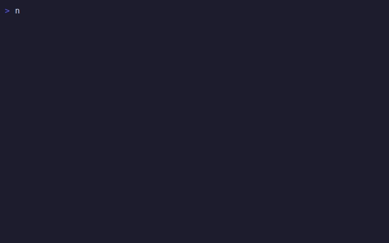
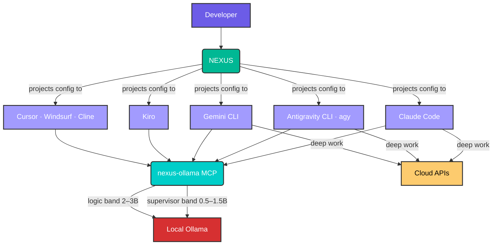

# NEXUS

[](https://github.com/canoo/agent-nexus/releases)
[](https://github.com/canoo/agent-nexus/actions/workflows/ci.yml)
[](LICENSE)
[](https://go.dev)
[](https://github.com/canoo/agent-nexus)
[](https://github.com/canoo/agent-nexus)
[](https://discord.gg/qCdkHVkRHP)

**Network of EXperts, Unified in Strategy**

Route boilerplate to local models. Save cloud credits for what matters. One config, every AI tool.

<p align="center">
  
</p>

## Quick Start

```bash
curl -sSL https://raw.githubusercontent.com/canoo/agent-nexus/main/install.sh | bash
nexus
```

> Make sure `~/.local/bin` is in your `PATH`: `export PATH="$HOME/.local/bin:$PATH"`

**Latest release: [v0.2.2](docs/releases/v0.2.2.md).** It completed the
stability sprint, moved Task Log to SQLite alone, repaired fresh installs, and
updated the Go/MCP toolchain with zero `npm audit` vulnerabilities.

---

## The Problem

Every AI coding tool speaks its own configuration dialect. Switching tools — or using more than one — means manually maintaining separate instruction files for each:

| Tool | Config file |
|---|---|
| Claude Code | `CLAUDE.md`, `AGENTS.md` |
| Cursor | `.cursor/rules/*.mdc` |
| Windsurf | `.windsurfrules` |
| Copilot | `.github/copilot-instructions.md` |
| Kiro | `.kiro/steering/*.md` |
| Cline | `.clinerules` |
| Continue.dev | `.continuerc.json` / `config.yaml` |
| Amazon Q | `.qrules` |

Developers describe this as "copy-pasting their soul from one tool's rule file to another." When a team member switches tools or a new one launches, all of that context has to be manually migrated — and the project memory trapped in one tool's scratchpad is lost entirely.<sup>[1]</sup>

On top of that, every tool has its own MCP server config location. Adding a single MCP server means editing JSON in three or four different places.

**NEXUS is the layer underneath all of them.** Define your project instructions, personas, and routing rules once. NEXUS projects them into each tool's native format, routes appropriate tasks to local models to reduce cloud spend, and preserves context across sessions and tool switches.

---

## What NEXUS Does Today

### 1. Complexity-based local routing (zero-token git)

NEXUS routes suitable micro-tasks to local Ollama models based on complexity,
reserving cloud API tokens for work that needs them. The most concrete example:
commit messages, lint fixes, and boilerplate generation routed to a local 1.5B
model instead of Sonnet. `nexus route --dry-run --goal "write a commit message"`
shows a route decision without running a model. A failed local route only falls
back to a cloud agent when `--allow-cloud-fallback` is explicitly set.

Developers routing these tasks locally report saving thousands of cloud tokens per day.<sup>[2]</sup>

```
Task: generate commit message from diff
→ Local:  qwen2.5-coder:1.5b  (~143 t/s, $0.00)
→ Cloud:  claude-sonnet        (~70 t/s, $0.003/req)
```

This matters more as AI Credits pricing shifts toward token-based billing across major providers.

### 2. Specialist persona system

NEXUS ships a library of specialist agent personas — engineering roles with defined responsibilities, tooling knowledge, and escalation behaviour. The orchestrator delegates to the right specialist rather than doing everything in one context.

Personas live in `~/.config/nexus/personas/` as markdown files. The active persona set is projected into every configured tool automatically.

### 3. Unified config projection

Steering files, personas, and routing rules are maintained in one place. The
installer links them into currently supported tools. Broader tool projection
and a `nexus sync` command are planned for the Universal Sync Layer.

### 4. MCP server for local model delegation

The `nexus-ollama` MCP server exposes local Ollama delegation as standard MCP tools. Any MCP-capable client can route tasks locally when configured with the server entry below, though installer and automatic registration support varies by tool.

```json
{
  "mcpServers": {
    "nexus-ollama": {
      "command": "node",
      "args": ["/home/you/.config/nexus/tools/mcp/server.mjs"]
    }
  }
}
```

Use your absolute home path — MCP clients do not expand `~` in `args`.
(The TUI Install screen and `setup-nexus.sh` register the server automatically
with the correct absolute path, so manual configuration is usually unnecessary.)

Available tools: `ollama_health`, `ollama_commit_msg`, `ollama_boilerplate`, `ollama_test_scaffold`, `ollama_lint_fix`, `ollama_logic_refactor`.

`ollama_health` checks that the local Ollama instance is reachable and lists
available models, so an AI client can verify the local compute plane is up
before delegating tasks to it.

### 5. TUI for setup and health

An interactive terminal UI handles installation, configuration, health checks, updates, task logs, and project memory. No config file editing required to get started.

### 6. Project memory (planned for v0.3.0)

The v0.3.0 development branch adds project memory for user-authored Markdown notes (decisions, preferences, blockers) stored locally at `~/.config/nexus/agent-memory/<project>/`.

Memory is explicit user-authored context, separate from consent-gated Desktop Companion activity; no automatic decision capture, synchronization, or GUI memory view exists yet.

```bash
nexus memory init my-project
nexus memory save my-project --title "Architecture Decision" --body "Keep project decisions in local Markdown." --tags "arch,db"
nexus memory list
nexus memory show my-project
# Use a filename printed by the preceding command:
nexus memory show my-project "filename-from-project-list.md"
nexus memory search "decisions"
```

You can also browse and manage project memories interactively via the **Project Memory** screen in the TUI (`nexus`).

### Companion data controls (v0.3.0 development)

The CLI and desktop share local retention and deletion controls. These commands
return JSON for scripts and AI agents; deletion requires explicit confirmation.
They affect only Companion activity, preserving MCP task history and project memory.

```bash
nexus companion data --json
nexus companion retention --days 14 --json
nexus companion prune --json
nexus companion clear --confirm --json
```

Raw retention defaults to 14 days and accepts 0–365 days; zero keeps no raw history.
The native host prunes expired spans while running. With the host inactive, use the
prune command. Browser/desktop runtime and packaging validation remain release gates.

### Usage data attribution

NEXUS's optional CLI usage integration is powered by
[Tokscale](https://github.com/junhoyeo/tokscale). Tokscale provides local
usage and pricing aggregates across supported AI CLIs; NEXUS presents those
aggregates separately from the routing, latency, and local-savings data it owns.
Thank you to the Tokscale maintainers and contributors for their upstream work.

---

## Tool Compatibility

### Shipped integrations (v0.2.2)

Automated tests in v0.2.2 cover installer setup, configuration projection, and MCP registration on Linux and macOS for the tools below. Installer CI validates CLI setup using a stubbed Claude CLI environment rather than live vendor E2E sessions. Ollama compute delegates are verified via MCP and shell contract tests.

| Tool | Config format | MCP registration | Test coverage & status |
|---|---|---|---|
|  Claude Code | `~/.claude/CLAUDE.md`, agents | ✓ Automatic | ✅ Shipped — installer & MCP tests pass (CI uses stub Claude CLI) |
| Antigravity CLI (`agy`) | Shared `~/.gemini/GEMINI.md` | ✓ Automatic | ✅ Shipped — installer & config tests pass (shared Gemini CLI config) |
|  Gemini CLI | `~/.gemini/GEMINI.md` | ✓ Automatic | ✅ Shipped — installer & config tests pass (shares config with `agy`) |
|  Kiro | `.kiro/steering/*.md` | ✓ Automatic | ✅ Shipped — installer & steering config tests pass |
|  Ollama | `.env` / TUI config | N/A (Compute host) | ✅ Shipped — compute MCP & shell contracts tested |

### Companion browser surfaces (unreleased v0.3.0 preview)

> [!NOTE]
> The Desktop Companion is currently an **unreleased v0.3.0 preview**. Browser adapters and provider mappings are verified under unit, protocol, and privacy contract suites; real browser extension host environments, GUI runtimes, and desktop packages are **not** yet validated. Note that Microsoft Copilot web companion integration is distinct from GitHub Copilot developer tooling.

| Component / Service | Type | Scope | Test status |
|---|---|---|---|
|  Google Chrome | Browser Adapter | Manifest V3 / native host | ⚠️ Preview — unit, protocol & privacy tested; browser runtime pending |
|  Microsoft Edge | Browser Adapter | Manifest V3 / native host | ⚠️ Preview — unit, protocol & privacy tested; browser runtime pending |
|  ChatGPT | Web Service Mapping | Selected-tab presence and duration | ⚠️ Preview — origin mapping & privacy contracts tested |
|  Claude (Web) | Web Service Mapping | Selected-tab presence and duration | ⚠️ Preview — origin mapping & privacy contracts tested |
|  Gemini (Web) | Web Service Mapping | Selected-tab presence and duration | ⚠️ Preview — origin mapping & privacy contracts tested |
| Microsoft Copilot (`copilot.microsoft.com`) | Web Service Mapping | Selected-tab presence and duration | ⚠️ Preview — origin mapping & privacy contracts tested (distinct from GitHub Copilot) |
|  Perplexity | Web Service Mapping | Selected-tab presence and duration | ⚠️ Preview — origin mapping & privacy contracts tested |

### Planned Developer Tools (Universal Sync Layer Projections)

The following coding tools are planned unverified targets for future Universal Sync Layer projections; live installer integration and sync are not yet active or verified:

| Tool | Target config format | Target status |
|---|---|---|
|  Codex | `AGENTS.md` projection | 🔄 Planned — unverified projection |
|  Cursor | `.cursor/rules/*.mdc` | 🔄 Planned — unverified projection |
|  GitHub Copilot | `.github/copilot-instructions.md` | 🔄 Planned — unverified projection (distinct from Companion web Copilot) |
|  Windsurf | `.windsurfrules` | 🔄 Planned — unverified projection |
| Cline | `.clinerules` | 🔄 Planned — unverified projection |
| Continue.dev | `.continuerc.json` / `config.yaml` | 🔄 Planned — unverified projection |

### Additional Tool Backlog

Other developer environments remain in our backlog for future evaluation:

- Amazon Q (`.qrules`)
- Crush (Agent Skills)
- Aider (`.aider.conf.yml`)
- Zed (`.zed/settings.json`)

---

## Architecture


```mermaid
graph TD
    classDef user fill:#6c5ce7,stroke:#333,stroke-width:2px,color:#fff;
    classDef nexus fill:#00b894,stroke:#333,stroke-width:2px,color:#fff;
    classDef tool fill:#a29bfe,stroke:#333,stroke-width:2px,color:#fff;
    classDef mcp fill:#00cec9,stroke:#333,stroke-width:2px,color:#fff;
    classDef local fill:#d63031,stroke:#333,stroke-width:2px,color:#fff;
    classDef cloud fill:#fdcb6e,stroke:#333,stroke-width:2px,color:#000;

    U[Developer]:::user --> N(NEXUS):::nexus

    N -->|projects config to| CC[Claude Code]:::tool
    N -->|projects config to| AGY[Antigravity CLI · agy]:::tool
    N -->|projects config to| GC[Gemini CLI]:::tool
    N -->|projects config to| KC[Kiro]:::tool
    N -->|projects config to| CU[Cursor · Windsurf · Cline]:::tool

    CC --> O(nexus-ollama MCP):::mcp
    AGY --> O
    GC --> O
    KC --> O
    CU --> O

    O -->|supervisor band 0.5–1.5B| L[Local Ollama]:::local
    O -->|logic band 2–3B| L

    CC -->|deep work| CL[Cloud APIs]:::cloud
    AGY -->|deep work| CL
    GC -->|deep work| CL
```

---

## Local Model Configuration

NEXUS defaults to `http://localhost:11434`. To use a dedicated GPU server, configure via the TUI or edit `.env` directly.

### Routing bands

| Band | Models | Tasks | Hardware |
|---|---|---|---|
| Supervisor | `qwen2.5-coder:1.5b` | Commit messages, JSON gen, boilerplate | 4 GB VRAM — >120 t/s |
| Logic | `llama3.2:3b` | Code generation, refactoring, lint fixes | 4 GB VRAM — ~75 t/s |
| Logic+ | `qwen2.5-coder:7b` | Complex refactors, multi-file edits | 8 GB VRAM |
| Heavy | `qwen2.5-coder:32b` | Architecture-level generation | 16 GB+ VRAM |

The supervisor and logic bands are the defaults. Override any route via environment variable:

```bash
NEXUS_SUPERVISOR_MODEL=qwen2.5-coder:1.5b
NEXUS_LOGIC_MODEL=llama3.2:3b
NEXUS_MODEL_COMMIT_MSG=qwen2.5-coder:1.5b   # per-task override
```

See [docs/model-configuration.md](docs/model-configuration.md) for hardware-specific presets (RTX 3060–5090, MacBook M3/M3 Max, multi-GPU).

---

## TUI

```
⚡ NEXUS Framework Manager

▸ Install NEXUS
  Configure
  Health Check
  Task Log
  Usage & Cost Dashboard
  Companion Tool Activity
  Update NEXUS
  Uninstall NEXUS
  Project Memory

j/k: navigate • enter: select • q: quit
```

## Dynamic routing preview

`nexus` with no arguments opens the TUI. Use `nexus --tui` to force that behavior. A prompt is routed by deterministic rules: recognized commit, boilerplate, test-scaffold, lint, and refactor requests use the local delegate; security, authentication, architecture, and ambiguous requests open an interactive Antigravity (`agy`) session.

```bash
nexus route --dry-run --goal "write a conventional commit message"
nexus "design authentication for a private Hub"
```

`--dry-run` prints the selected route without running a model. Local failures stop with an actionable error. Add `--allow-cloud-fallback` only when you explicitly approve sending that prompt to `agy`.

| Screen | What it does |
|---|---|
| **Install** | Step-by-step wizard: validates repo, creates symlinks, configures MCP, checks deps, pulls Ollama models |
| **Configure** | Edit Ollama host URL and model overrides inline |
| **Health Check** | Verifies Ollama reachability, symlink integrity, MCP server status |
| **Task Log** | Read recent MCP tasks from SQLite: model, route band, latency, status, and cloud-equivalent versus actual local cost |
| **Usage & Cost Dashboard** | NEXUS-native task routing stats and cloud-cost savings, plus Tokscale CLI usage aggregates (shown separately) |
| **Companion Tool Activity** | Read privacy-preserving tool activity from SQLite with independent disabled states |
| **Update** | Checks latest release and self-updates with checksum verification |
| **Uninstall** | Removes all symlinks and binary with confirmation |
| **Project Memory** | Browse, read, create, search, and delete local user-authored project Markdown notes |

### Maintenance

NEXUS includes automated maintenance via GitHub Actions:
- **Recurring Chores**: Runs twice-weekly to update Go/Node.js dependencies, perform security audits (`govulncheck`, `npm audit`), and verify project integrity.

---

## Installation

### One-liner

```bash
curl -sSL https://raw.githubusercontent.com/canoo/agent-nexus/main/install.sh | bash
```

Downloads the pre-built `nexus` binary and clones the repo to `~/.config/nexus/repo`.

### From source

```bash
git clone https://github.com/canoo/agent-nexus.git
cd agent-nexus
bash setup-nexus.sh
```

Requires Go 1.27.1 or newer to build the TUI binary.

---

## Project Structure

```
core/           Orchestrator instructions (NEXUS.md, AGENTS.md, kiro steering)
personas/       Specialist agent definitions
tools/tui/      NEXUS TUI (Go / Bubbletea v2)
tools/mcp/      nexus-ollama MCP server (Node.js)
tools/compat/   Tool driver registry (tools.json) — planned Universal Sync Layer
prompts/        Engineering rules and quality gates
docs/           Documentation and hardware presets
tests/          Integration tests
```

---

## Roadmap

The next planned release and its gates are in the
[Companion release plan](docs/companion-release-plan.md).

| Version | Theme | Key deliverables |
|---|---|---|
| **v0.1.6** | Security fixes | Checksum hardening, input validation, PAT removal — [Released] |
| **v0.2.0** | Observability core | Session logging, cost tracker, live TUI dashboard — [Released] |
| **v0.2.1** | CLI usage ingestion | Tokscale adapter and separate Usage & Cost Dashboard — [Released](docs/releases/v0.2.1.md) |
| **v0.2.2** | Stability and SQLite Task Log | Fresh-install fixes, SQLite-only task history, Go 1.27.1, zero audit vulnerabilities — [Released](docs/releases/v0.2.2.md) |
| **v0.3.0 (planned)** | Desktop Companion private preview | Explicit consent, Chrome/Edge extension, strict native host, Linux/macOS controls, and routing foundation |
| **v0.3.1 (planned)** | Universal sync layer | `nexus adopt`, `nexus sync`, AGENTS.md projection, tool driver system, nexus-context MCP, compatibility matrix |

| **v0.3.5** | Community benchmarks | Benchmark schema, hardware-tiered test runner, community submission pipeline, results showcase |
| **v0.4.0** | Persona marketplace & registry | Dynamic package manager (`canoo/Nexus-Personas`), `nexus persona install`, persona composition, auto-update |
| **v1.0.0** | Stable | Windows/Docker support, team features, stable public API |

---

## Prerequisites

**Required for installers:** Bash, git, Node.js ≥22.13.0, and one or more
supported AI tools (see [compatibility table](#tool-compatibility)).

**Optional:** [Ollama](https://ollama.com/) for local model delegation.

> **Platform support:** Linux and macOS. Windows support is tracked in [#18](https://github.com/canoo/agent-nexus/issues/18).

> No Go toolchain needed — the `nexus` binary is a pre-built download.

---

## Testing

```bash
# Go unit tests
cd tools/tui && go test ./...

# Full install/uninstall cycle (isolated temp $HOME)
bash tests/test-install-cycle.sh

# Companion test suite (extension, native host, desktop frontend & Rust)
cd apps/companion-browser-extension && npm test
cd apps/companion-native-host && npm test
cd apps/companion-desktop && npm ci && npm audit && npm test
cd apps/companion-desktop && cargo +stable test --manifest-path src-tauri/Cargo.toml --locked
```

---

## Contributing

See [CONTRIBUTING.md](CONTRIBUTING.md) for development setup, PR guidelines, and commit conventions.

### Looking for contributors

NEXUS is an early open-source project and is actively looking for a few steady contributors as the next milestones come together:

| Role | Good fit if you like | Current focus |
|---|---|---|
| **Discord/community moderator** | Welcoming new users, collecting feedback, keeping discussions organized, setting up webhooks, and working with Discord bots or the Discord Developer Platform | Help shape community norms, surface useful bug reports, automate helpful community workflows, and turn recurring questions into docs or issues |
| **Integrator** | Connecting tools, MCP servers, CLIs, and config formats | Help test NEXUS across Claude Code, Gemini CLI, Kiro, Cursor, Windsurf, Cline, Continue.dev, and local Ollama setups |
| **Developer** | Go, Node.js, terminal UX, automation, or local AI workflows | Help with observability, tool sync, routing, tests, cross-platform support, and release polish |
| **Documentation/discussion contributor** | Explaining workflows clearly and asking good product questions | Help write guides, forum posts, dependency proposals, and milestone summaries |

Thanks to Blake Saunders ([@blakesaunders](https://github.com/blakesaunders)) for improving Claude Code support.

We welcome focused integration pull requests as well as compatibility reports. When submitting compatibility results or bug reports, please include your OS, tool version, and reproduction steps as outlined in [CONTRIBUTING.md](CONTRIBUTING.md).

If any of that sounds useful, [join the Discord](https://discord.gg/qCdkHVkRHP), open a GitHub Discussion, or pick up an issue from the current milestones. Small, focused contributions are welcome.

## Security

See [SECURITY.md](SECURITY.md) for vulnerability reporting.

---

## Research and Sources

NEXUS's design is informed by documented developer pain points in the AI coding tool ecosystem:

<sup>[1]</sup> Configuration wall and context leakage: r/ChatGPTCoding, r/LocalLLaMA, r/ClaudeCode — April 2026. Developers describe manually syncing `.cursor/rules/*.mdc`, `CLAUDE.md`, and `.github/copilot-instructions.md` as "copy-pasting their soul" between tools.

<sup>[2]</sup> Zero-token git workflow: r/ClaudeCode — April 2026. Teams routing commit messages and boilerplate generation to local Ollama (`qwen2.5-coder:1.5b`) report saving thousands of cloud tokens per day.

Additional references: [Smithery MCP registry](https://smithery.ai) · [Official MCP registry](https://registry.modelcontextprotocol.io) · [Model Context Protocol](https://modelcontextprotocol.io)

---

## License

[MIT](LICENSE) © 2026 [Codelogiic](https://www.codelogiic.com)
